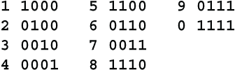

# 17 密码

本章涵盖

构建密码的思路

尽管在密码、密码机和现在的数字加密方面取得了进步，但军队始终依赖于密码。即使在今天，我们也可以假设军队仍然将密码作为备用，以防电子设备出现故障或电力不可用。

大多数密码将字母、音节、单词或短语替换为固定大小的组，通常是 3、4 或 5 位十进制数字，或者是 3 或 4 个字母的组。可变长度的密码很少见。密码通常分为两种类型，单一密码和双重密码。在单一密码中，单词和短语按字母顺序列出，并且代码组按数字顺序分配，尽管不是连续的，因此可以使用相同的列表查找单词和代码组。这种方法的弱点是显而易见的。如果你的对手已经弄清楚了代码 08452 的含义是 CANNON，那么他们就知道与 08452 接近的任何代码必须有类似 CAMOUFLAGE、CAMPAIGN、CANCEL、CANINE、CANVAS、CAPITAL、CAPITULATE、CAPSIZE、CAPTAIN 等含义。

在双重密码中，代码组是以随机顺序分配的。密码书将包含两个单独的列表，一个按字母顺序列出单词和短语，另一个按数字顺序列出代码组。过去，双重密码需要数月的时间才能编制，并且成本很高。因此，一个政府可能会多年使用相同的代码，从而大大削弱其有效性。自 1960 年代以来，编制双重密码的工作可以在几秒钟内由计算机完成。

密码编制者有很多技巧来使他们的密码更加安全。对于常见的单词和短语，他们会提供许多等效的代码组，或者同义词。因此，海军密码可能有 10 到 20 个代码组代表“ship”，而陆军密码可能有相同数量的代码组代表“artillery”，外交密码可能有同样多的代码组代表“treaty”。密码往往有很多空组。消息的整个部分可能完全为空。某些代码组可能具有多重含义，取决于某个指示器，例如前一组的最后一个数字。

有些密码书是以两列印刷的。根据某个指示器，密码来自左列或右列。例如，如果当前的代码组以偶数数字开头，则从左列取下一个代码组，否则从右列取下一个代码组。

## 17.1 小丑

*小丑* 是我自己发明的一种密码风格。如果有读者想要设计自己的密码，小丑可能会给他们一些有用的思路。基本概念是，在每个代码组中，一个字母或数字与其他字母或数字不同。例如，在一个 5 字符组中，4 个字符将携带意义，而另一个字符，称为小丑，存在于此以制造混乱。仅仅有一个空字符就会让对手的工作变得更加困难，但是你还可以用这个特殊的字母或数字做更多的事情。

假设一个 5 位数字组的代码。其中 4 位是代码本身，另一位是小丑。为了开始，假设小丑总是在每条消息中第一个代码组的中间位置。还假设这是一个 2 列代码书，左列的代码与右列的代码完全不同。例如，左列的 0022 可能表示“救援”，而右列的 0022 可能表示“引擎”。

同样，小丑可能有两列含义，因此小丑可以移动到不同的数字位置，也可以移动到不同的列。

这里是您可以为小丑分配的可能含义列表。不止 10 个。您可以选择您想要的 10 个。或者，使用 2 列并为小丑选择 20 个含义。或者，使用字母而不是数字，并为小丑选择 26 个含义。

+   从下一组开始，小丑向左移动 1 个位置。

+   从下一组开始，小丑向右移动 1 个位置。

+   从下一组开始，小丑移动到位置 1。

+   从下一组开始，小丑移动到位置 2，依此类推。

+   仅对于下一组，小丑在位置 1。

+   仅对于下一组，小丑在位置 2，依此类推。

+   切换到代码的左列。

+   切换到代码的右列。

+   切换到代码的相反列。

+   仅对于下一个代码，使用相反的代码列。

+   对于接下来的 2 个代码，使用相反的代码列，依此类推。

+   接下来的组为空。

+   下一组之后为空。

+   接下来的 2 组为空，依此类推。

+   在下一组中，代码为空，但小丑是真实的。

+   在下一组中，代码是真实的，但小丑是空的。

+   交换接下来的 2 组的顺序。

+   在下一组的代码中加上 1111（不进位相加）。

+   在下一组的代码中加上 3030（不进位相加），依此类推。

+   如果下一个代码是偶数，则加上 2222，否则减去 2222（不进位）。

+   在下一组中，将小丑加 1（不进位）。

+   在下一组的小丑中加 2（不进位），依此类推。

+   将这个 4 位代码加到下一个 4 位代码中。小丑除外。

+   反向阅读下一个代码的数字，例如 1075 实际上表示 5701。

+   忽略接下来的代码，直到有一个以 0 开头的代码。

+   下一组是一个特殊指示器。

有关不进位相加的示例，请参见第 4.6 节。

特殊指示器需要更详细的解释。在特殊指示器中，代码组的所有 5 位数字都有特殊用途，比如告诉小丑将在哪里，或者使用哪一列。例如，特殊指示器 13152 可能意味着在接下来的 5 组中，小丑将按顺序出现在位置 1、3、1、5 和 2。特殊指示器还可以告诉接下来的 5 个代码从哪一列取出，奇数表示代码来自左列，偶数表示代码来自右列。特殊指示器 10384 可能意味着在接下来的 5 组中，代码将依次从左、右、左、右和右列中取出。

另一个特殊指示器的用途可能是指定要添加到接下来的 5 组代码中的数字。例如，特殊指示器可能意味着将以下值添加到 4 位代码中：

这些值将使用非进位加法，模 10 加法进行相加。

小丑总是指示接下来的组或组中要采取的行动，而不是当前组或前一组。例如，不应使用意思为“取消前一个小丑”的小丑。当一个小丑指示涵盖几个后续组的行动时，请确保两个不同小丑的行动不冲突。例如，不应该在第 20 组中有一个小丑说，“接下来的 3 个代码取自左列”，然后在第 21 组中有一个小丑说，“接下来的 3 个代码取自右列”。

可以与小丑代码一起使用的另一个技巧是使用字母 A 到 E 代替小丑。这个字母可以出现在任何位置，并取代小丑的预期位置。字母 A 表示下一个小丑将在位置 1，B 表示位置 2，依此类推。您还可以为字母 F、G 和 H 分配含义。例如，F 可以表示代码应从相反的列中取出，下一个小丑将在位置 1。

如果有可能将字母 I 误认为是数字 1，请不要使用字母 I。我喜欢使用字母 J 作为超级小丑。它表示接下来的一切都是空的。您可以继续输入另外 10、20 或 100 组代码的胡言乱语，真的让艾米莉陷入狂喜。或者，您可以使用这些空白来发送一个误导性的虚假消息，比如“诺曼底登陆推迟到 6 月 10 日在犹他海滩进行”。
