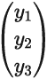
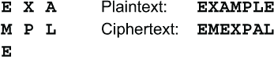
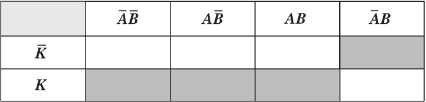
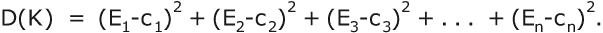
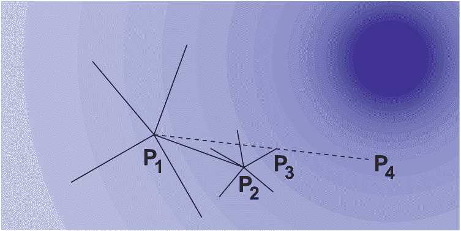
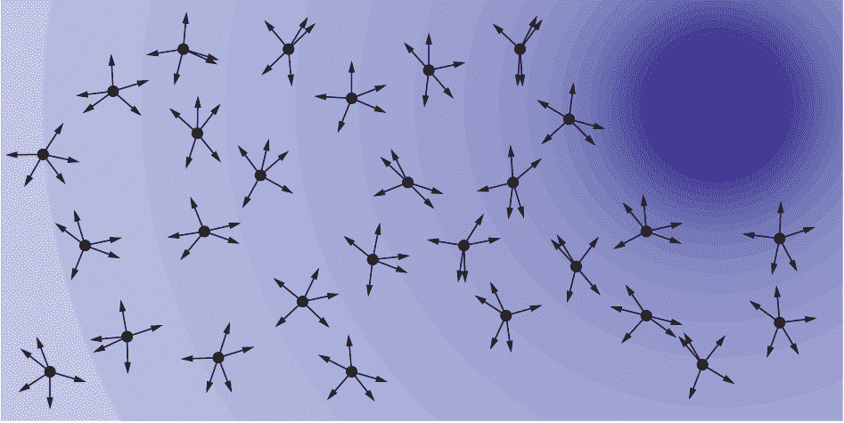
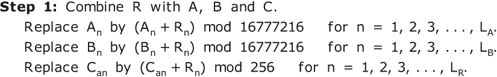
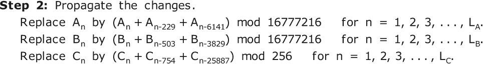
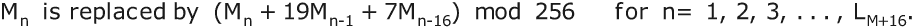

# 18 量子计算机

本章内容包括

+   量子计算机的特性

+   使用量子计算机进行通信

+   使用量子计算机进行密钥交换

+   使用量子计算机解决优化问题

+   使用量子计算机解密分组密码

+   超级计算机，超越量子计算机

当我写这本书时，量子计算机还处于萌芽阶段。全世界没有超过 20 台量子计算机，其中没有一台包含超过大约 50 个 qubit 或量子比特。我写这一章时知道其中很多内容可能已经过时，甚至在书发布之前就被证明是错误的。量子力学和量子计算中使用的许多数学远远超出了本书的范围，因此本章的部分内容将简单提及量子方法和算法，而不解释它们的工作原理。

量子计算的基础是*量子比特*，或*qubit*。一个 qubit 有两个*基态*，分别表示为**|**0〉和**|**1〉，对应于传统计算机中普通比特的 0 和 1 状态。符号**|**1〉被称为*bra-ket*符号。当尖括号在左边时，如〈0|，称为*bra*，因此〈0|读作“bra-0”。当尖括号在右边时，称为*ket*，因此**|**1〉读作“ket-1”。这种符号是由诺贝尔物理奖获得者英国物理学家保罗·阿德里安·莫里斯·狄拉克发明的。

在传统计算机中，普通比特具有明确的值，可能是 0 或 1。该值只能是 0 或 1，不能是某个中间值，也不能同时是多个值，有时是 0 有时是 1。物理设备，如表面上的磁点，可以通过施加电流或磁场从一个值切换到另一个值。可能会有一个短暂的过渡，但设备不能停留在任何类型的中间或混合状态。

## 18.1 叠加

相比之下，qubit 在进行测量或观察之前没有值。在那时，它的值将是 0 或 1。基态**|**0〉表示其值为 0 的概率为 1.0，基态**|**1〉表示其值为 1 的概率为 1.0。一般来说，qubit 将处于两个基态α**|**0〉+β**|**1〉的*叠加*状态，其中α和β是复数，使得|α|²+|β|² = 1。当测量时，这个 qubit 产生 0 的概率是|α|²，产生 1 的概率是|β|²。符号|α|表示α的*幅度*。复数 a+bi 的幅度是√(*a*² + *b*²)。由于测量结果是概率性的，两个处于相同状态的 qubit 的测量结果可能不同。可以叠加任意数量的状态。

当一个量子态 x 由几个量子比特组成，比如 x[1]、x[2]、x[3]时，态〈x|被表示为一个行向量（*x*̅[1]，*x*̅[2]，*x*̅[3]），其中每个分量上方的横线表示*复共轭*。如果复数*α*为 a+bi，则其复共轭*α̅*为 a-bi。复共轭具有性质，即乘积*α**α̅* = a²+b² = |*α*|²。反之，态|y〉被表示为一个列向量。

由于这个示例中的行向量是一个 1×3 矩阵，列向量是一个 3×1 矩阵，它们可以相乘。矩阵乘积，表示为〈x|y〉，是一个 1×1 矩阵，其单个元素是内积*x̅*•y。也就是说，〈x|y〉是一个标量。(如果这很陌生，你可以复习第 11.3 节。)

由于任意两个状态可以叠加，并且这些状态反过来又可以叠加，任意量子比特可能处于任意多个状态的叠加中。

叠加态是脆弱的。小的扰动，比如温度波动或机械振动，可以导致量子比特退出叠加态，并回到基态之一。这称为*退相干*。这种脆弱性是实现大型可靠量子计算机的主要障碍。特别是，当进行测量时，量子比特将*退相干*并掉入观察到的任一基态。同样，量子比特不能被复制，因为那将需要一个观测。

如果难以理解复数系数的概念，也许这会有所帮助。在笛卡尔坐标中想象点(a,b)。从原点(0,0)到点(a,b)的线段是一个向量。它既有大小又有方向。当两个状态叠加时，根据坐标几何的规则将这些向量相加，这恰好是复数相加的方式。这就是为什么概率被表示为复数的原因。在向量相加后，必须重新调整系数，使|α|²+|β|² = 1。如果α和β用角度描述，则可以消除重新调整，使用角度的三角函数公式描述角度的和与差。

量子比特可以使用一些基本逻辑函数进行操作，以形成量子电路。一个例子是条件非门函数 CNOT，它对 2 比特量子比特**|**xy〉进行操作。CNOT 定义为**|**xy〉如果 x = 0，和**|**xy'〉如果 x = 1。换句话说，第一个比特保持不变，第二个比特是两个比特的异或。

## 18.2 纠缠

除了叠加之外，粒子还可以显示第二个量子力学属性，称为*纠缠*。如果一个粒子的某个属性与其他粒子的同一属性之间存在相关性，则称该粒子组为*纠缠*。例如，电子具有称为*自旋*的属性。关于特定轴（如 x 轴）的自旋可能在粒子组中是相关的。或者，一组光子的极化可能是纠缠的。即使粒子相距很远，这种纠缠也可能存在。这使得纠缠可以用于通信。

该过程始于创建一对纠缠粒子。一种方法是将激光束通过一种特殊类型的晶体。这导致一些高能光子分裂成两个低能光子。其中一些光子对将是纠缠的，尽管产率非常低，例如十亿分之一。下一步是将这些纠缠光子传输到桑德拉和莉娃将要传输和接收的地方。对于长距离传输，通常的方法是通过光纤传输它们，尽管它们也可以通过晶格中的空腔物理携带。

当桑德拉准备发送她的消息时，她将她的光子与一些特别准备好的称为*辅助光子*的光子相互作用。这种相互作用导致她的光子采取她希望传输的所需状态。这导致了莉娃的纠缠光子，它可能在数英里之外，采取互补状态。过去人们认为这是瞬时发生的，但是变化是以光速传播的。信息不能瞬间传输，尽管几代科幻作家都幻想过这一点。

最后，莉娃测量她的纠缠光子并确定 1 比特的消息——或者不确定，因为这是一个概率过程。这有时被科学家们称为*量子传送*，他们读了太多科幻小说。据说这是安全的，因为如果艾米丽测量了光子，它会解缠，桑德拉和莉娃应该可以检测到。

这里存在两个缺陷。(1) 艾米丽可能不在乎她的窃听是否被发现。只要她知道这些信息，桑德拉和莉娃知道她知道可能并不重要。(2) 艾米丽的目标可能不是收集信息；她的目标可能是扰乱通讯。艾米丽可能不会得知秘密作战计划，但莉娃也不会。实际上，如果桑德拉和莉娃发现艾米丽在窃听，他们可能会更少地使用量子链接，这对艾米丽也是有利的。

## 18.3 错误校正

由于量子事件是概率性的，量子计算机的错误率比传统计算机高得多。必须有一些手段来检测和纠正错误。在经典计算机中，有错误检测和纠正码。这些码使用额外的位来检测差异，例如通过为每个字节添加奇偶校验位来检测错误。奇偶校验位通常是 8 个数据位的异或。这意味着带有错误位的 9 位字节将始终具有偶校验。如果奇偶校验是奇数，那表明发生了错误，但它并不告诉错误是什么。

传统计算机最简单的纠错码形式是 2-3 码。每个位有 3 个副本。如果发生单位错误，两个副本仍将具有正确值。如果单位错误的几率是，比如，10⁷中的 1，那么使用这种常见值将将错误几率降低到 10¹⁴中的 3，这是一个巨大的改进。使用 3 位来表示每个数据位是昂贵的，但有几种类型的码，如海明码和卷积码，使用更少的额外位，其中一些可以检测和纠正多位错误。在当前的加密中，无错误的通信是绝对必要的，即使改变一个位也可能使消息无法阅读。

这种类型的错误检测和纠正在量子计算机中是不可能的。这些码依赖于复制位的值并检查码的奇偶性。这些在量子比特中无法完成，因为测量量子比特的值会导致其退相干。提供量子纠错通常依赖于使用额外的量子比特。错误检测和纠正量子比特可以与数据量子比特交错排列在一个被称为*表面码*的平面晶格结构中。

到目前为止，量子纠错仅仅是理论上的。还没有人建造出实用的设备。额外的纠错位需求增加了实用量子计算机所需的量子比特数量。由于量子错误率很高，实用量子计算机可能仍然遥不可及。在阅读以下各节中各种量子算法的描述时，请记住这一点。

## 18.4 测量

测量光子的极化是一件棘手的事情。想一想你如何测量一束光的极化。你通过一个极性滤波器传递光束并观察亮度。然后慢慢旋转滤波器，直到经过滤的光达到最大亮度。在那一点上，滤波器与光束的极化对齐，你可以测量角度。

然而，里瓦没有这样的奢侈。她正在处理一个单光子。它穿过她的滤光片或晶体，要么她检测到闪光，要么没有。如果她的滤光片与桑德拉的发射器不对齐，那么她获得与桑德拉相同状态的几率取决于相对角度。例如，如果她的探测器与桑德拉的发射器呈 90º角度，那么她获得量子位相同值的几率正好是 50%。

解决这个问题的方法是桑德拉发送一串光子。里瓦可以对这些光子进行采样，通过各种滤光片进行传输。她可以通过使用光传感器和电压表测量每个样本的亮度，并计算准确的极化角度。然后她以那个角度进行测量，并以非常高的概率获得与桑德拉相同的基态。利用量子计算机进行密码学可能最终取决于区分极化中微小渐变的能力。

## 18.5 量子三阶段协议

这为 2006 年由俄克拉荷马州立大学的 Subhash Kak 发明的*三阶段量子协议*奠定了基础。Kak 的 3 阶段协议使用与第 16.1、16.2 和 16.4 节讨论的其他三次传递算法相同的 3 消息框架。在量子版本中，加密操作是围绕选择的空间轴随机旋转极化。桑德拉和里瓦必须就轴达成一致意见，否则旋转将不会交换。 (1) 桑德拉发送经过她随机角度φ旋转的光子， (2) 里瓦将光子旋转她的秘密角度ψ并发送经过φ+ψ旋转的光子， (3) 桑德拉应用逆旋转-φ并发送经过里瓦角度ψ旋转的光子，里瓦移除以读取量子位。如果艾米丽尝试测量任何旋转的量子位，她无法知道她的探测器是否具有正确的角度，因此也无法知道获得正确值的概率。

使用这种方法，桑德拉和里瓦必须经常改变它们的角度，最好是每个比特都要改变。否则，艾米丽可以随意选择一个随机角度并尝试读取每条消息。如果艾米丽的角度接近正确角度，那么她将在 80%甚至 90%的比特上得到正确值。这足以让她能够读取消息。幸运的话，她将能够读取大约 25%的消息。请注意，艾米丽的角度接近 180º也同样有用，因为这将给她 80%到 90%的比特的逆。

## 18.6 量子密钥交换

有几种类似于 Diffie-Hellman 密钥交换的量子密钥交换算法。其中最著名的算法是*BB84*，以其发明者 IBM 研究院的查尔斯·H·贝内特和蒙特利尔大学的吉尔·布拉萨德命名。该算法使用 4 个量子位允许在通信信道中检测和纠正噪声。由 Emily 引起的任何扰动都简单地视为通道中的额外噪声，因此不需要进一步检测或纠正。

这项工作的一个推论是，几个松散纠缠的粒子可以结合成更少数量的紧密纠缠粒子。

## 18.7 格罗弗算法

*格罗弗的* *密码算法* 是一种使用量子计算机破解诸如 DES 和 AES 这样的秘密密钥分块密码的算法。它由贝尔实验室的洛夫·库马尔·格罗弗在 1996 年开发，基于他的量子文件搜索算法。该算法将加密函数的每次评估都视为对未排序数据库的一次读取访问。该算法将期望的评估次数从 K 减少到 √K，其中 K 是可能的密钥数量。实际上，这将密钥大小从 n 位减小到 n/2 位。

格罗弗算法以很高的概率找到密钥 k，使得 E(k,p) = c，其中 E 是加密函数，p 是明文，c 是密文。该算法需要每个这样的密钥一个已知明文块。一个量子物理学家，可能对密码学知之甚少，可能会得出这样的结论，即对抗格罗弗算法需要将所有加密密钥的大小加倍。这是低效的，因为它会需要额外的块密码轮次。例如，使用 128 位密钥的 AES 使用 10 轮，而使用 256 位密钥的 AES 使用 14 轮。

一个更便宜的替代方法是通过在主加密前后添加一个简单快速的密码步骤，如简单替代，来增加密钥大小。用于混合两个简单替代字母表的密钥可以达到每个 1684 位（5.2 节），因为每个字母表可以有 256! 种可能的排列，接近于 2¹⁶⁸⁴。简单的转位也可以帮助扩展密钥大小，但方式更受限，因为 16! 大约是 2⁴⁴。如果选择使用转位，您可以一次转位两个块，因为 32! 大约是 2¹¹⁸，总密钥大小显著增加。

读者们会意识到，格罗弗算法也可以通过使用空值、为每个块使用不同的密钥、链接块或压缩消息等基本手段来进行打败。这意味着在块加密之前通过混合哈夫曼（4.2.1 节）之类的压缩密码实现两个目标，即更大的密钥和压缩，一举两得。混合哈夫曼的缺点是它改变了块大小。在块密码之前和之后使用哈夫曼替换（10.4 节）或者邮件替换（10.5 节）可能更明智。

## 18.8 方程式

在我们讨论下一个话题——量子模拟退火之前，我们需要讨论方程式。 许多密码可以表示为方程组。 比拉索密码可以表示为 C = P+K，其中 C 是密文，P 是明文，K 是密钥，都是在模 26 的整数中表示的。 希尔密码是一组线性方程。 像普莱费尔和双平方这样的密码会被表示为基于 5 的方程式。

### 18.8.1 交换

交换可以很容易地表示为相等集合。 例如，列转置

可以表示为 c[1] = m[1], c[2] = m[4], c[3] = m[7], c[4] = m[2], c[5] = m[5], c[6] = m[3], c[7] = m[6]，其中 m[i] 为明文消息字符，c[j] 为密文字符。

*逻辑函数*可以转换为如下的数值方程：

**not** x → 1-x

x **or** y → x+y-xy

x **and** y → xy

x **xor** y → x+y-2xy

### 18.8.2 替换

替换可以通过一个三步过程转换为方程形式。 首先，使用密钥和明文的比特将每个密文比特表示为布尔表达式。 例如，考虑这个替换，它接受一个 1 位密钥 K 和一个 2 位明文 AB，生成一个 2 位密文 XY。

| **K** | **AB** | **XY** | **布尔输入** |
| --- | --- | --- | --- |
| 0 | 00 | 01 | ***K̅A̅B̅*** |
| 0 | 01 | 11 | ***K̅A̅B*** |
| 0 | 10 | 00 | ***K̅AB̅*** |
| 0 | 11 | 01 | ***K̅AB*** |
| 1 | 00 | 10 | ***KA̅B̅*** |
| 1 | 01 | 00 | ***KA̅B*** |
| 1 | 10 | 10 | ***KAB̅*** |
| 1 | 11 | 11 | ***KAB*** |

这里 ***K̅A̅B̅*** 意味着 K = 0，A = 0 和 B = 0， ***K̅A̅B*** 意味着 K = 0，A = 0 和 B = 1，依此类推。 现在可以将密文位 X 写为 X = ***K̅A̅B***+***KA̅B̅***+***KAB̅***+***KAB***。 Y 也有类似的表达式。

### 18.8.3 卡诺图

*卡诺图*用于简化或简化这些表达式。 这是第二步。 这个概念是贝尔实验室的莫里斯·卡诺纳于 1953 年发明的。 这个想法是把所有可能的 n 位输入集合看作 n 维空间，2×2×2×...×2。 填充每个输出比特为 1 的单元格。 这是输出比特 X 的空间。 Y 也会有一个类似的图。

注意此地图中的列是如何标记的。 当您从一个单元格移到下一个单元格时，从左到右只有一个位改变，包括从第 4 列到第 1 列的环绕步骤。 这种排列被称为*格雷码*。 格雷码由贝尔实验室的弗兰克·格雷于 1947 年发明。 通过一次附加一个位轻松构造格雷码。 例如，要将这个 2 位格雷码扩展为 3 位格雷码，首先以顺序列出 4 个 A,B 对 ***A̅B̅***，***AB̅***，***AB***，***A̅B***，每个对应的 ***C̅***，然后以相反的顺序列出每个对应的 ***C***。 ***C*** 位只更改两次，第四个代码组后和第八个代码组后环绕到开始。

卡诺图让您通过眼睛优化逻辑达到大约 6 位的水平，3 水平和 3 垂直，使用一个 8 单元格乘以 8 单元格的地图。 超过 6 位最好用程序来做。 每个步骤都要添加最大的矩形块，该矩形块适合填充区域内，并覆盖至少一个尚未被覆盖的新单元格。 块的每个维度都必须是 2 的幂，因此其体积也将是 2 的幂。 如果有几个最大尺寸的块，请选择覆盖尚未覆盖的大多数单元格的块之一。 继续，直到所有填充单元都被覆盖。

在 K，A，B 示例中，填充区域中有两个 1×2 块，即 ***KA*** 和 ***KB̅***。 每个都覆盖 2 个单元格。 由于它们一起覆盖 3 个单元格，因此两者都是必需的。 这只留下了单元格 ***KAB̅*** 需要被覆盖。 因此，X 的简化表达式为 ***KA***+***KB̅***+***KAB̅***。

将替换这些表达式中的**and**，**or**和**not**函数为算术表达式，遵循先前的规则，作为将替换的第三步。

### 18.8.4 中间变量

如果您尝试将诸如 AES 这样的复杂分组密码中的每个密文位表示为单个表达式，则该表达式的大小将随每轮呈指数增长。 这个问题有时被引用为你不能使用方程式来破解分组密码的原因。 胡扯。 这个问题可以通过使用中间变量来消除。 让每一轮的输出成为一个单独的变量集。

第一轮的输入，密钥，明文和链向量(s)是*独立*变量。 这些位中的任何一个都可以独立于其他位变化。 每一轮或每一轮内的每个阶段的输出是*相关*变量。 这包括下一个块的链向量。 它们的值完全由独立变量的值确定。 不能改变其中一个位而不改变其他变量的一些位。

### 18.8.5 已知明文

假设 Emily 有一定量的已知明文。为简单起见，假设这是一个 n 位的消息块。她的目标是利用已知的明文和拦截的密文确定密钥。假设 Emily 已经找到了每个密文位的表达式，这些表达式是关于明文、密钥和可能的链向量的。设第 i 位的表达式为 E[i]，设 c[i] 为密文的第 i 位。对于任何给定的密钥 K，Emily 可以通过计算对应于使用密钥 K 对已知明文进行加密得到的密文与拦截的密文之间的差异来衡量：

当找到正确的密钥时，D(K) 将为 0。在这里，D(K) 称为*目标函数*，或简称*分数*。

## 18.9 最小化

引入目标函数将找到正确密钥的问题转换为一个最小化问题。目的是最小化函数 D(K) 的值。量子计算机的工作原理是因为系统的量子态总是趋向于最低能量态。如果可以配置量子计算机，使得量子比特或量子比特组表示变量的值，而系统的能量对应于目标函数的值，那么最低能量态将对应于目标函数的最小值。如果可以实现这种配置，那么量子计算机将能够解决各种现实世界的问题，包括破译密码。

起初，用实数替换密钥中的位。最终这些数字必须是 0 或 1，但允许变量在搜索过程中超出 0-1 范围是有利的。从某些初始值开始，例如将所有位设置为 .5，或将它们设置为 0-1 范围内的随机值，然后调整它们的值以减少 D(K) 的值，尝试将其减少到 0。

现在有许多与传统计算机一起使用的优化技术，但让我们只看三种。使用这些算法找到加密密钥将需要大量已知明文。至少已知明文应该是密钥大小的 3 倍。

### 18.9.1 爬山法

*爬山法*，也称为*最陡下降法*或*梯度法*，是最古老的优化方法之一。其思想是从某一点 P[1] 开始，看看随机方向上的几个等距点。在这些点中，选择改进最大的点 P[2]，也就是具有最小 D(K) 值的点。然后通过查看接近 P[2] 的随机点来细化方向。从 P[2] 到任何这些点的距离将远小于从 P[1] 到 P[2] 的距离。将这个点称为 P[3]。从 P[1] 到 P[3] 的线定义了搜索方向。最后，找到这条线上使 D(K) 最小的点 P[4]。搜索重复使用 P[4] 作为起点。随着搜索的进行，从 P[i] 到 P[i+1] 的步长在找到改进时逐渐增加，如果没有改进则减小。

这种搜索形式在搜索空间形状像 n 维空间中的单个山或被许多较小的山丘包围的大中央山时效果很好。在具有许多局部最优解的更复杂地形中，它可能失败得很严重。在这个图中，颜色越深，分数越好。

### 18.9.2 千峰

*千峰*，或*千峰*，是我在 20 世纪 70 年代参加各种谜题比赛中取得胜利的方法。后来，我开始为一些计算机期刊撰写这种搜索方法，但我陷入了试图表征这种搜索方法比其他搜索方法更好的目标函数类型的困境中。这种方法在 20 世纪 90 年代以*粒子群*优化的名字重新被发现。

想象搜索空间就像是一个有许多峰、谷和山脊的山脉。现在想象一队飞机飞越这片地形，通过降落伞投放数百名登山者。换句话说，有许多同时的起点。这些登山者会查看附近的点，看看这些地点是更高还是更低。有两种变体。（1）你可以选择这些点中最好的一个，并将登山者移动到那里。在这种情况下，如果没有一个点更好，你会减小步长并重试。如果这次失败，比如连续失败 3 次，那么你会引入一个新的登山者，他会从一个随机位置开始。（2）你保留显示改进的几个点。你可以将这看作是登山队分成几个小组尝试不同的路径。最好不要选择所有改进的解决方案，因为这会迅速将所有登山者集中在几个区域。

我最初的想法是将所有解保留在一个堆结构中，以便顶部条目始终是最差的解。你拿到那个最差的条目并尝试改进它。但这被证明是低效的，因为你花了大量的精力去改进最终被丢弃的差解。相反，总是选择最好的解会把所有爬山者都集中在一个单一的高峰上。最佳策略是随机选择下一个爬山者。同样，在一个解产生多个改进解时，不总是选择其中最好的有利。有时，随机选择几个改进解更好。

### 18.9.3 模拟退火

*模拟退火*是一种流行的优化技术，主要是因为它很容易实现。你从搜索空间中的一个随机点开始，并查看附近的一个点。如果那个解更好，那么以概率 B 移动到该点。如果那个解更差，那么以概率 W 移动到该点。

模拟退火的定义特征是在搜索过程中改变概率。最初，你设定拒绝好解的机会或接受坏解的机会相当高。比如，你拒绝 40%的更好解，接受 30%的更差解，即 B = .6 和 W = .3。然后在一段时间后，比如 1000 步之后，你会降低拒绝好解的概率。也许在第二阶段，你拒绝更好解的 20%，接受更差解的 15%。再过一段时间，比如再 2000 步之后，你可能只开始拒绝更好解的 10%，接受更差解的 7%。

这个过程被称为模拟退火，因为它类似于金属热处理中的热退火过程，在这个过程中，金属首先被加热直到发光，然后非常缓慢地冷却。这改变了金属的结晶结构，减少了其硬度，增加了其韧性和延展性，使其更容易加工。在模拟退火中，拒绝更好解和接受更差解的高初始概率类似于金属的高温状态，而这些概率的逐渐降低则类似于金属的缓慢冷却。对模拟退火的描述通常提到概率逐步降低的几个阶段称为*降温*。

让我传授一些我在模拟退火中的经验：

+   过于缓慢是不值得的。每个阶段的接受/拒绝率应该在前一率的 1/2 到 2/3 之间。例如，第一阶段是 40%，然后 20%，10%，5%，3%。或者，从 40%开始，然后 25%，15%，10%，6%，4%，最后 2.5%。

+   通常五个阶段就足够了。

+   以 50%的接受率开始是浪费时间的。从 60%到 75%之间开始。

+   将接受率降到 0% 是得不偿失的。如果最后一个阶段接受了 2% 到 3% 的更差的解决方案，你将获得更大的改进。

+   当什么都不发生时停止。你可能计划在每个阶段进行 1000 次试验，但如果你已经进行了 100 次尝试而没有改变，就停止吧。

+   让百分比取决于改进的大小。例如，在第一阶段，你可以接受改进分数为 1% 的变化的 60%，改进分数为 2% 的变化的 75%，改进分数为 3% 或更多的变化的 90%。

+   实验。每个优化问题都是不同的。尝试改变阶段的数量、每个阶段的试验次数、改变概率的速率、步长和改进程度与接受率之间的关系。

爬山、千山万峰和模拟退火技术可以自由组合，产生各种混合方法。

## 18.10 量子模拟退火

有几种提议的方法可以利用量子计算机进行模拟退火。这些方法利用量子现象如叠加来并行执行许多搜索。然而，每次试验都需要在选择的点上评估目标函数。量子计算机不适用于评估表达式。到目前为止，尚无方法可以通过量子手段并行评估这些函数。量子计算机可以利用传统计算机来评估表达式，但这将失去并行性。到目前为止，量子搜索还没有显示出比传统计算机搜索更快的改进。

## 18.11 量子因式分解

RSA 公钥密码系统的强度取决于大整数因式分解的难度。给定两个大整数 A 和 B，将它们相乘得到乘积 AB 是很容易的，但要反向执行这个过程并确定大整数的因子则非常困难。对一个大数进行因式分解的难度与计算离散对数（第 16.3 节）的难度相同，并且使用许多相同的技术。

这种安全性可能会被用于因式分解大数的 Shor 算法突破。这是第一个量子算法，由 MIT 的 Peter Shor 在 1994 年发明。如果该算法能够成功地用于大整数，那么 RSA 必须被放弃，或者模数必须变得更大，也许是数百万位。到目前为止，使用 Shor 算法，2001 年将数字 15 因式分解为 3×5，2012 年将数字 21 因式分解为 3×7。按照这个速度，我们可以期待到 2023 年左右将数字 35 因式分解为 5×7。

开个玩笑，Shor 算法对 RSA 安全性的真正威胁可能要几十年后才会出现。

## 18.12 超级计算机

量子计算机并不是为了评估表达式而制造的——至少目前不是。但让我们假设这只是一个技术问题。假设将来会有混合计算机，结合了超级计算机的计算能力和量子计算机的并行性。让我们称这些为*超级计算机*。

桑德拉今天可以做些什么来为艾米莉拥有超级计算机的时代做准备？我们可以从我们击败格罗弗算法的方式中获得启示（第 18.6 节）。我们扩大了密钥的大小，超过了算法的能力。这在超级计算机上也是可行的。我们可以增加计算机需要处理的未知数的数量，超出您估计超级计算机可能具有的任何能力。让我们看看这两个方面，替换和随机数生成。

这些算法将需要极其庞大的加密密钥。让我们简单地接受，在未来存在超级计算机的世界中，这样巨大的密钥将是可管理的。

### 18.12.1 替换

如果一个替换没有通过某种数学规则定义，那么它可以通过一个替换表来定义。表中的每个条目是桑德拉知道但艾米莉不知道的值。每个表条目可以被视为数学意义上的一个变量。最初，每个变量可以取任何值。如果艾米莉学到了其中一些值，那么对其他变量的选择就会变得更加狭窄，但最初任何字符都可以替换为任何其他字符。

桑德拉的目标是压倒超级计算机的能力。一个通用的多表密码手动使用 26×26 的表格，但计算机使用 256×256 的表格。这提供了 2¹⁶，或者 65,536 个未知值。然而，并没有理由限制表格中的行数为 256。如果艾米莉有一个超级计算机，那么桑德拉也有一个速度快、内存大的计算机是合理的。桑德拉可以使用 1024 行带有 10 位密钥的表格，或者使用 4096 行带有 12 位密钥的表格，甚至使用 65536 行带有 16 位密钥的表格。这需要 2²⁴ = 16,777,216 字节的内部存储空间用于替换表，远远在当前个人计算机的容量范围内。此外，对于 8 位替换使用 16 位密钥提供了非常理想的冗余性。让我们称这个 2²⁴元素的表格为*Tab24*。Tab24 的每一行都有自己的混合密钥。如果这个混合密钥有 256 位，那么整个表格就有 256×65536 = 16,777,216 位密钥。

对于桑德拉来说，使用完整的双字母频率表也是可行的。一个 256×256 的双字母频率表，使用 8 位密钥选择一行（实际上是一层），需要 2²⁵ = 33,554,432 字节的内部存储空间。同样，这在今天是可行的。如果表格有 65536 层和 16 位密钥，那么将需要一个更大的计算机。

但请记住，这些替换表必须保密，并且必须是完全随机的。即使它们是由某种算法生成的，也必须绝对超出艾米莉的超级计算机确定生成器的初始状态和参数的能力。请参阅第 13.13 节了解一些相关方法。

### 18.12.2 随机数

第 13.13 节的方法是一个很好的起点，但要制作一个能经得起超级计算机考验的伪随机数生成器，我们将第 13.11 节的选择生成器概念与第 13.15 节的刷新生成器技术相结合。

*超级生成器* UG（发音为 HUGE-ee）使用三个数组，A、B 和 C。数组 A 和 B 各包含 65,536 个条目，每个条目都是 24 位整数。数组 C 包含 2²⁴，即 16,777,216 个条目，每个条目都是 8 位整数。这 3 个数组可以从自然照片中初始化，如第 13.14.2 节所述。桑德拉和里瓦必须有相同的数组。生成器在每个周期中产生一个 8 位输出。第 n 个周期包括以下步骤：

1.  计算 x = (A[n]+A[n-103]+A[n-1071]) mod 16777216，并将 A[n]替换为 x。

1.  减少 x = x mod 65536，并设置 y = B[x]。

    该周期内 UG 生成器的输出是 C[y]。

1.  将 B[x]替换为(B[x]+B[x-573]+B[x-2604]) mod 16777216。

1.  将 C[y]替换为(C[y]+C[y-249]+C[y-16774]) mod 256。

下标根据需要在模 65536 或模 16777216 下循环。103、1071、...、16774 这些滞后值并没有什么特别之处。我没有测试这些值是否产生特别长的周期。有了如此巨大的种子数组，即使是退化周期也会非常长。你可以使用第 13.1 节的任何组合函数，比如**madd**，或者第 13.14.1 节的滞后线性加法。

当你刷新这些随机数时，第 13.14 节的两种方法在你的对手拥有超级计算机时不足以使用，但它们可以结合起来制作一个强大的刷新函数。每次刷新时，你将需要一个包含 65,536 个或更多 24 位整数的新随机数组 R。让 A、B、C 和 R 的长度分别为 L[A]、L[B]、L[C]和 L[R]。

这里 a = ⌊L[C]/L[R]⌋-1。符号⌊L[C]/L[R]⌋，读作“L[C]/L[R]的底”，表示不超过 L[C]/L[R]的最大整数。例如，⌊8/3⌋是 2，⌊9/3⌋是 3。使用 C[an]而不是 C[n]的效果是将 R 的字节均匀分布在 C 数组中。

这两个步骤应该重复 3 次或更多次。如常，下标循环。

顺便说一句，C 数组的大小不一定必须是 2 的幂。L[C]可以是，例如，77,777,777，这种情况下 A、B 和 R 数组需要包含模 77777777 的整数，而模 16777216 将在上述计算中被 77777777 替换。对于 L[C]的大小的唯一限制是您希望使用的存储量以及分发如此大密钥的实际情况。

这两种技术，替换和随机数生成，可以结合起来制作任意数量的块和流密码，可以抵御超级计算机。接下来的两节介绍了每种类型的一种密码。

### 18.12.3 超替代密码 US-A

写这一节时的一个巨大诱惑是指定一个巨大的块大小，比如 65,536 甚至 16,777,216 字节。然而，仅仅因为在超级计算机时代加密必须改变，并不意味着消息的类型会改变。少于 100 个字符的消息仍然很常见，将这样的消息填充到 65,536 字节或更大的块大小将是极其低效的。

让我们将样本超替代密码称为*US-A*。US-A 密码以 32 字节或 256 位的块为单位运行。每个块中的 32 字节交替地被视为 32 个单独的字节和一个 16×16 位的位数组。US-A 密码有 15 轮，每轮包括 3 个步骤：替换、行置换和翻转数组。15 轮后跟着最后的替换步骤。

16 个替换步骤使用 Tab24 替换表，每个字符需要 16 个密钥位，每轮总共需要 16×32 = 512 位，或者 15 轮加上最后的替换需要 8192 位。每个 15 轮中的第二阶段是对每一行进行置换。这可能只是行的循环移位，每行只需要 4 位，因此每轮需要 64 位，总共 960 位。

对于位置换的更强选项是拥有一个置换表，比如 256 个不同的置换，比如密钥置换（第 7.6 节）。16×16 位矩阵的每一行将被单独置换。每行置换将由 16 个十六进制数字指定，比如**5A3F1E940B2D68C7**，意味着第一个位将移到位置 5，第二个位移到位置 A，即 10，依此类推。每行的置换将由一个 8 位密钥从表中选择，每轮需要 8×16 = 128 位，或者 15 轮总共需要 1920 位。

每轮的第三阶段是翻转位数组，即交换(i,j)处的位和(j,i)处的位。这在第 11.7 节中有描述，并且在第 11.2.3 节中给出了翻转数组的快速方法。这个阶段没有密钥。

让我们将所有 3 个阶段结合起来。US-A 密码需要 8192 位用于替换密钥，以及，比如说，1920 位用于密钥转置，总共是 10,112 位密钥。这远远不足以抵御超级计算机所需的 65,536 位。不用担心。别忘了，替换使用了 Tab24 表格，为了混合其 65,536 行，使用了 16,777,216 位密钥，更不用提用于混合置换表的比特数了。

为了额外的强度，我建议使用明文到明文（模式 **PP**）分块链接（第 11.10 节）与 US-A 密码。

### 18.12.4 超流密码 US-B

第 18.11.1 节的 Tab24 替换和第 18.11.2 节的伪随机数生成器可以结合起来制作一个强度极高的流密码。称其为*US-B*密码。US-B 在加密之前使用一个预处理步骤使明文具有随机外观。假设消息为 M，其长度为 L[M]。预加密步骤为

额外的 16 次循环迭代用于对消息的前 16 个字符进行双重哈希处理。这一步骤并不增加密码强度，但却使 Emily 很难辨认出她找到了正确的密钥。

每个 16 位字符密钥 K[n] 由随机数发生器生成的两个连续输出字节 x 和 y 组合而成，即 256x+y。（或者，你可以将 C 数组设为 16 位整数，但这会使所需存储空间翻倍。）密钥 K[n] 被用来在 Tab24 替换表中对消息字符 M[n] 进行加密，形式为 Tab24(K[n],M[n])。也就是说，M[n] 的替代字符取自表格的第 K[n] 行。

你可能会认出这是使用大型表格和随机密钥的通用多字母密码。请记住，法国人称多字母密码为*不可破译的密码*。使用 UG 超生成器，US-B 多字母密码最终在超级计算机时代也是不可破译的。我们已经实现了不可破解的加密。
