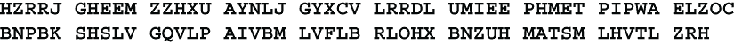

# 附录 A：娱乐页面

这个图表中有四个独立的密码，从 S1 到 S4。每个密码都是一个简单的单表替换。你的任务是识别类型，比如摩斯码，然后解决它。每个密码都以标准英文书写，使用大写字母，不带空格或标点符号。每个密码长度介于 75 到 90 个字母之间。所有密码都从左上角单元格开始。前 3 个密码从左到右跨越行读取。最后一个密码按照顺时针方向沿着边界读取。

所有方法都在这本书中描述了。唯一的区别是视觉呈现方式。你需要确定每个密码中哪些特征是相关的，比如高度、宽度、位置或颜色。你可以按照本书其他地方隐藏的说明提交你的答案以获取学分。

这里有一些额外的有趣密码，使用了一些最流行的业余爱好者密码。这些密码是标准英文，带有一些专有名词。按照惯例，字母被分组为五个，不论周期。如果你想要更多类似的密码，可以考虑加入美国密码协会，网址为[cryptogram.org](http://cryptogram.org)。你可以按照本书其他地方隐藏的说明提交你的答案以获取学分。你可以在[www.contestcen.com/crypt.htm](http://www.contestcen.com/crypt.htm)找到更多要解决的密码。

F1：Belaso 密码（第 5.8.1 节）

F2：维吉尼亚密码（第 5.8.2 节）

F3：栏式置换（第 7.2 节）

F4：Playfair 密码（第 9.2 节）

F5：Bifid 密码（第 9.6 节）

区块大小为 7，主题是园艺。

F6：一次性密码本（第十四章）

对于消息中的每个字母，都生成一个随机数。如果这个数字是偶数，就对字母加上 X 对 26 取模，否则对 Y 对 26 取模。

当然，一次性密码本不是一种业余爱好者密码。我把它包括在内是为了说明一些一次性密码本密码在实践中是可以被破解的。你能看出如何找到 X 和 Y 的值而不尝试所有 676 种组合吗？

F7：通用多表密码（第 5.9.3 节）

为了增加乐趣，还有来自几种语言的字符，并且使用了超过 26 个字符。然而，每个字母表只包含了 26 个不同的字符，并且消息是标准英文。

