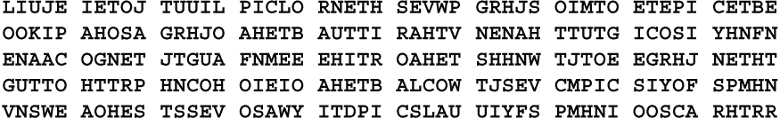
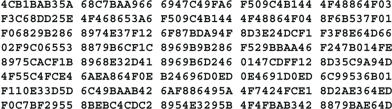
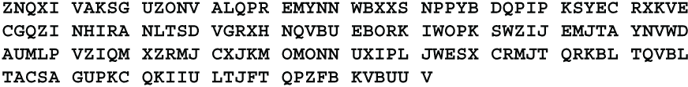

# 附录 B. 挑战

这些密码图被呈现给读者作为挑战。 方法未给出。 您的任务是确定方法并解决密码图。 提供了足够的材料，以便已确定方法的有经验的业余爱好者可以解决它。 在所有情况下，语言都是英语。 文本读起来正常且符合语法。 没有特别努力来扭曲标准英语字母频率或联系频率。

这些都是单步密码。 没有混合方法，比如将替换与置换相结合。 这些挑战密码被评为三级。

C1: 挑战 #1

这是一种纸笔密码。 明文由 250 个大写字母组成，没有单词间隔或标点符号。

C2: 挑战 #2

这个密码可以手工解密，但使用一些计算机辅助来管理十六进制表示会更容易。 明文由混合大小写的 200 个字符组成，带有单词间隔和标点符号。

C3: 挑战 #3

这个密码可以手工加密和解密。 明文由 180 个大写字母组成，没有单词间隔或标点符号。

